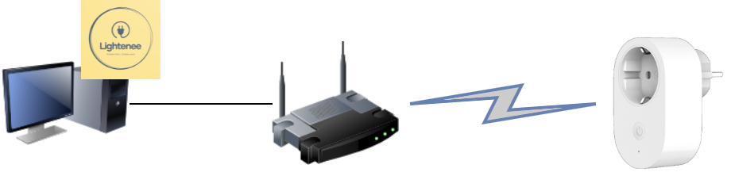

# Lightenee 💡🤑

> #scripting #Powershell #IoT #SmartHome

Lightenee is a script created to manage the automated power on/off of Xiaomi Mi Smart Plug devices running on a local network, depending on the "n" cheapest hours of the Voluntary Price for the Small Consumer (PVPC) of the Spanish electricity market. It is coded in Powershell to provide cross-platform (Windows, Linux, and macOS) compatibility.

---

##  Index 📑

- [Prerequisites](#prerequisites-⚠️)
- [How to obtain needed call parameters](#how-to-obtain-needed-call-parameters-🤔)
- [Executing Lightenee](#executing-lightenee-🚀)
- [Logs](#logs-📚)
- [How does it work?](#how-does-it-work-🤓)

---

## Prerequisites ⚠️

Lightenee has a few dependencies that must be fulfilled to achieve proper performance. **These dependencies must be installed** on the machine Lightenee will run, including their **appropriate PATH configuration**:

- [Powershell](https://github.com/PowerShell/PowerShell)
- Pyhon 2/3
- [Python-miio library](https://github.com/rytilahti/python-miio)

---

## How to obtain needed call parameters 🤔

In order to establish a connection with the Xiaomi Mi Smart Plug device(s), Lightenee needs to know two essential parameters:

### IP of the Xiaomi Mi Smart Plug device

It can be easily rescued from your router's GUI utility. There is not an standard way to recover the IP I can explain here, since it depends a lot on your router's model.

> **Hint:** If your router has a DHCP configuration, you may want to take advantage of the router's GUI utility to also establish an exception with your Xiaomi Mi Smart Plug device(s) and bring it/them a **static IP address**, so it could be possible in the future to call Lightenee without the fear of a randomly IP address change, so I strongly recommend doing it.

### Token of the Xiaomi Mi Smart Plug device

The obtention of the token may be more challenging. Still, it is well-documented around the Internet, with many multiple methods, as they could be: via [Mi Home app logs](https://python-miio.readthedocs.io/en/latest/discovery.html#tokens-from-mi-home-logs), via [backups](https://python-miio.readthedocs.io/en/latest/discovery.html#tokens-from-backups), or, which **I recommend the most**, via dedicated apps, as [Get Mi Home Devices Token App](https://github.com/Maxmudjon/Get_MiHome_devices_token).

> **Suggestion:** [How to obtain Mi Home device token](https://github.com/Maxmudjon/com.xiaomi-miio/blob/master/docs/obtain_token.md)

---

## Executing Lightenee 🚀

After ensuring that you have already configured the previously detailed prerequisites, as well as you own the token and IP address of the Xiaomi Mi Smart Plug device you want to play with, you can call the script using the following structure:

```powershell
lightenee.ps1 -ip <<IP>> -token <<TOKEN>> -hours <<NUMBER OF EXECUTION HOURS>>
```

**Parameters "-ip" and "-token" are mandatory** and will be requested anyway if not provided. The parameter "-hours" is optional, and it represents the number of hours you want the Xiaomi Mi Smart Plug to be on; that is, "n" cheapest hours. If no hours are provided, it will work with the 8 cheapest hours by default.

---

# Logs 📚

Every execution of Lightenee will print the results out via terminal, if possible, and in a log file called "lightenee.log", which will be placed in the same folder the script is placed.

It will save: the execution date and hour, if it had sent a turn on or a turn off message and the result of that execution order.

---

## How does it work? 🤓

Lightenee retrieves the information of the "n" cheapest hours of the Voluntary Price for the Small Consumer (PVPC) of the Spanish electricity market, making use of the "preciodelaluz.org" public API, which can be accessed from https://api.preciodelaluz.org/.

A typical case of use would be to schedule the execution of Lightenee in periodically short pieces of time (like every hour, every 30min, etc.). Some utilities like Cron could be helpful!
Once executed, Lighteene will check the current hour is one of the "n" cheapest hours, according to the information retrieved from the previously mentioned API. If so, it will send a turn-on message to the indicated Xiaomi Mi Smart Plug device, thanks to its IP and its token. Otherwise, it will send a turn-off message. This way, the electric device plugged in the Xiaomi Mi Smart Plug will only operate in the cheapest hours of the day, helping you to decrease your bills.

Therefore, Lightenee is thought to be run into a 24/7 running device connected to your local network. As it is a simple script, it can be run into a low-consumption device, like a Raspberry Pi or similar.

